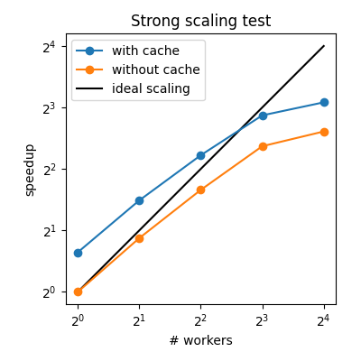

# parallel-matplotlib-animation

Create matplotlib animations rendered to video in parallel, with efficient resources reuse.

## Installation

```bash
pip install parallel-matplotlib-animation
```

or from a local copy:
```bash
git clone https://github.com/sibocw/parallel-matplotlib-animation.git
cd parallel-matplotlib-animation
pip install -e . --config-settings editable_mode=compat
```

## What it does

Renders matplotlib animations by:
1. Creating a bunch of worker processes, and creating matplotlib resources (plt.Figure, plt.Axes, artists, etc.) once per worker
2. Distributing frames across workers via a dynamic queue
3. Rendering the assigned frames from each worker, but updating the data only (without redrawing the whole plot from scratch) 
4. Encoding frames to video with PyAV (very efficient FFmpeg under the hood)

**Key design: Figure reuse.** In each worker process, `setup()` runs once to create the figure, then `update()` modifies it repeatedly. This brings the best of:
- Serial processing: avoids the overhead of recreating complex layouts for every frame
- Parallel processing: accomplishes speedup by using multiple CPU cores

## Quick example

```python
import numpy as np
import matplotlib.pyplot as plt
from parallel_animate import Animator

# Step 1: Create a child class of parallel_animate.Animator
class WaveAnimation(Animator):

    # Step 2: Define how the plot should be setup
    def setup(self):
        fig, ax = plt.subplots()
        self.x = np.linspace(0, 4 * np.pi, 200)
        (self.line,) = ax.plot(self.x, np.cos(self.x))
        ax.set_xlim(0, 4 * np.pi)
        ax.set_ylim(-1.5, 1.5)
        ax.set_xlabel("x")
        ax.set_ylabel("y")
        ax.set_title("Cosine Wave")
        return fig  # <- return a plt.Figure object

    # Step 3: Define how plot elements should be updated for each frame
    # (given parameters that you define later)
    def update(self, frame_idx, params):
        phase = params["phase"]
        self.line.set_ydata(np.cos(self.x + phase))

# Step 4: Define a list of input parameters, one for each frame
params = [{"phase": 2 * np.pi * i / 60} for i in range(60)]

# Step 5: Make video in parallel
anim = WaveAnimation()
anim.make_video("wave.mp4", param_by_frame=params, fps=30, num_workers=4)
```


## Usage
This library has a single class: `parallel_animate.Animator`. To make an animation, you must create your own class inheriting from it and define the following methods:

- **`.setup(self)`**: No input argument except `self`. In this method, you can setup your figure however you like. Just make sure you return the figure you created (i.e. the `plt.Figure` object). You might want to save the things you created as attributes—axes, return values of plotting calls like `plt.plot`, etc. This way, you can access and modify them in the update method.
- **`.update(self, frame_idx, params)`**: Given the frame index and some input parameters, update the plot elements. `params` is typically a dictionary of variables, but really it can be any Python object (tuple, a single value, etc.) as long as it's picklable. In this method, you want to call methods like `.set_data` on the plot elements that you created in setup and saved as attributes.
- (Optional) **`__init__(self, ...)`**: You can add any custom logic here. It's handy if you want to create many animation instances using the same custom class, but with different parameters. For example, if you make `__init__` accept an input data path, you can do things like `anim = RecordingAnimator(dataset_path=...)` and animate many datasets in a loop.

Once you have defined your animator class, there is a single method that you need to call that makes the video: **`.make_video(...)`**. It accepts the following arguments:

- `output_file` (Path or str): Output video path
- `param_by_frame` (list): List of parameters. Each element in the list is the `params` argument to be given to the `.update` call for the corresponding frame.
- `fps` (int): Frame rate of the output video
- `num_workers` (int): Number of worker processes to be spawned. If -1, use all CPU cores. If -2, use all but one CPU cores, etc. If 1, no child process is created and the video is made in the main process itself. Default is -1.
- See the docstring for `parallel_animate.animator` directly for less commonly used, optional parameters. These control logging, rendering quality, etc.


## Examples

See [`src/parallel_animate/examples/`](https://github.com/sibocw/parallel-matplotlib-animation/blob/main/src/parallel_animate/examples/):
- `simple_wave_animation.py`: The example above
- `multi_panel_animation.py`: 5 subplots with different plot types
- `very_complex_animation.py`: 14 subplots with GridSpec layout


## Performance test

A [strong scaling test](https://hpc-wiki.info/hpc/Scaling_tests#Strong_Scaling) is implemented in `src/parallel_animate/examples/scaling_test.py`. Here's the result on my 8-core (16-thread) Intel Core i9-11900K Processor:



The left-most blue dot indicates serial processing with resources reuse. The black line indicates ideal scaling (zero overhead) if all frames are rendered completely independently in parallel (as is the case in all parallel matplotlib animation libraries I found). Blue dots at 1+ workers are what's implemented in this library.


## Unit tests
```bash
python -m unittest discover -s tests
```